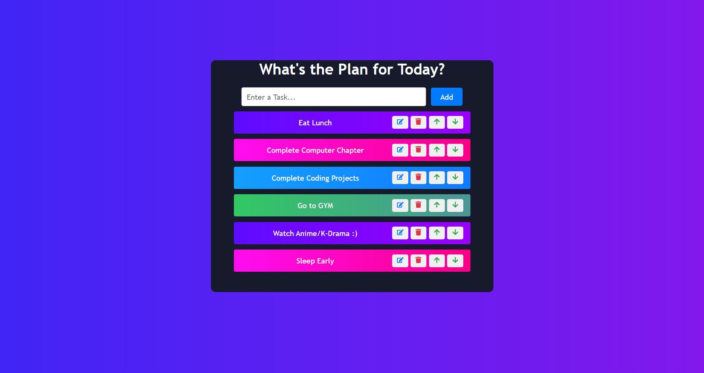

# To-Do List Application

A simple and elegant To-Do List application built with React. This application allows users to add, edit, delete, and move tasks within a list. The task items are color-coded in a visually appealing manner using CSS gradients.

## Features

- **Add Tasks**: Easily add new tasks to the list.
- **Edit Tasks**: Update existing tasks with new information.
- **Delete Tasks**: Remove tasks that are no longer needed.
- **Move Tasks**: Reorder tasks by moving them up or down in the list.
- **Responsive Design**: The layout adjusts to different screen sizes for optimal viewing.
- **Color-coded Tasks**: Tasks are displayed with alternating background colors for better readability.

## Installation

To use this component in your React application, follow these steps:

1. Save the following files into your `src/` folder in your React project directory:
   
   - `App.jsx`(as ToDoList file is linked to this)
   - `ToDoList.jsx`
   - `index.css` (if styling is separate)

3. Ensure you have React set up and configured in your project.

## Preview

